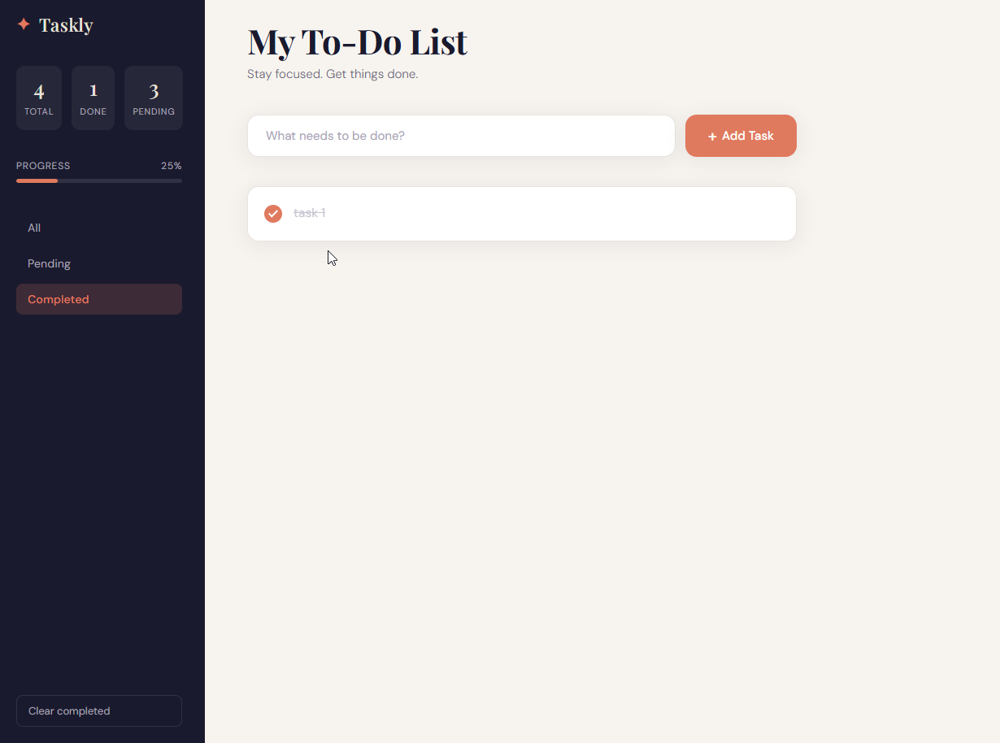

# Taskly - Context-Aware To-Do List



**Taskly** is a beautifully designed, focus-oriented To-Do application that helps you organize your day with elegance and ease. Built with vanilla JavaScript and modern CSS, it features a responsive interface, local data persistence, and real-time progress tracking.

## ✨ Features

- **Intuitive Task Management**: Easily add, edit, and delete tasks with a clean UI.
- **Smart Filtering**: View All, Pending, or Completed tasks to stay focused on what matters.
- **Progress Tracking**: Visual progress bar and completion percentage that updates in real-time.
- **Data Persistence**: Your tasks are automatically saved to your browser's Local Storage, so you never lose your list.
- **Responsive Design**: Seamlessly adapts to desktop, tablet, and mobile screens.
- **Custom Aesthetics**: Features a sophisticated color palette, smooth animations, and curated typography (Playfair Display & DM Sans).

## 🛠 Tech Stack

- **Frontend Structure**: HTML5 (Semantic)
- **Styling**: CSS3 (Variables, Flexbox, Animations, Responsive Media Queries)
- **Logic**: Vanilla JavaScript (ES6+, DOM Manipulation, LocalStorage API)
- **Fonts**: [Google Fonts](https://fonts.google.com/)

## 🚀 Getting Started

No installation or build steps required! You can run this project directly from your browser.

1.  **Clone the repository**:
    ```bash
    git clone https://github.com/your-username/taskly.git
    ```

2.  **Open the application**:
    -   Navigate to the project folder.
    -   Double-click `main.html` to open it in your default web browser.

## 📂 Project Structure

```text
Taskly/
├── images/             # Icon assets
├── screenshot/         # App screenshots for documentation
├── main.html           # Main HTML structure
├── style.css           # Core styles and responsive design
├── script.js           # Application logic and state management
└── README.md           # Project documentation
```

## 🔮 Future Improvements

- [ ] **Dark Mode**: Toggle between light and dark themes.
- [ ] **Categories**: Group tasks by custom tags or categories (e.g., Work, Personal).
- [ ] **Drag & Drop**: Reorder tasks with simple drag-and-drop actions.

## 📄 License

This project is licensed under the MIT License - see the LICENSE file for details.

---

<p align="center">
  Made with ❤️ by abd
</p>
